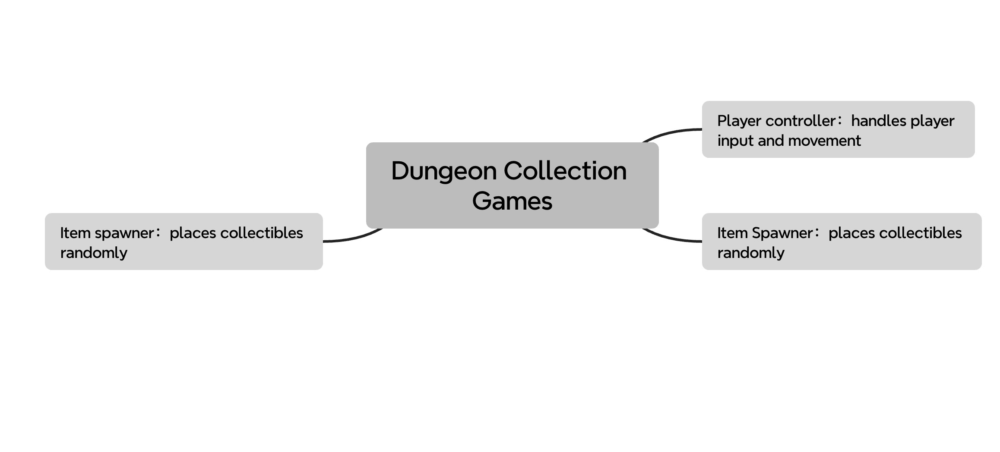
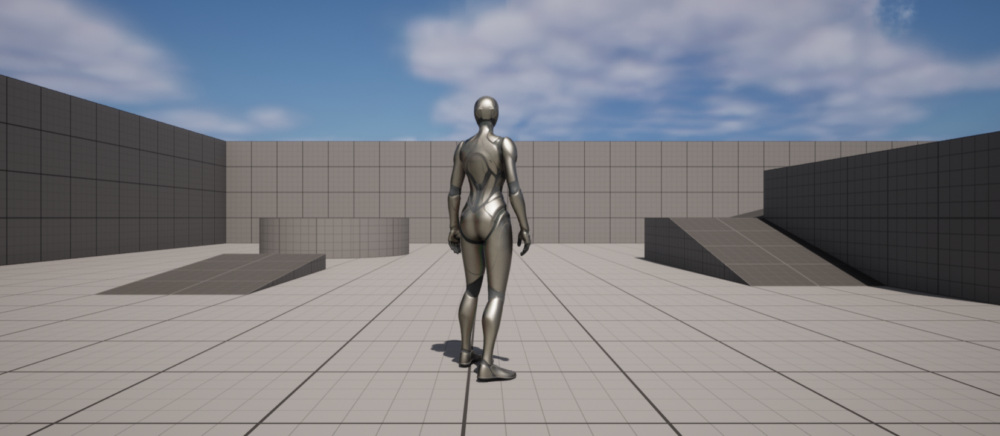
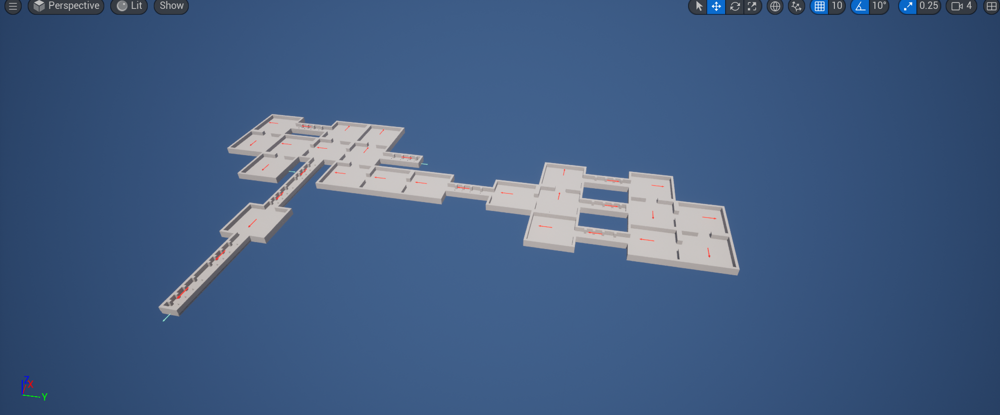

# Final Project!

This is it! The culmination of your procedural graphics experience this semester. For your final project, we'd like to give you the time and space to explore a topic of your choosing. You may choose any topic you please, so long as you vet the topic and scope with an instructor or TA. We've provided some suggestions below. The scope of your project should be roughly 1.5 homework assignments). To help structure your time, we're breaking down the project into 4 milestones:

## Project planning: Design Doc (due 11/6)
Before submitting your first milestone, _you must get your project idea and scope approved by Rachel, Adam or a TA._

### Design Doc
Start off by forking this repository. In your README, write a design doc to outline your project goals and implementation plan. It must include the following sections:

#### Introduction
- What motivates your project?
- The idea for this project comes from combining gameplay elements from Pac-Man and Diablo. I’ve always enjoyed the collection mechanics in Pac-Man and the randomized dungeon generation in Diablo, so I thought it’d be interesting to combine the two. The goal is to create a game where players can explore a procedurally generated dungeon, collect items,and have a unique  experience every time.

#### Goal
- What do you intend to achieve with this project?
- The main goal is to build a dungeon exploration game where players can move around in a randomly generated map, collect items, and enjoy a fresh experience each time due to the varied dungeon layouts.

#### Inspiration/reference:
- You must have some form of reference material for your final project. Your reference may be a research paper, a blog post, some artwork, a video, another class at Penn, etc.  
- Include in your design doc links to and images of your reference material.
- Resources：https://www.youtube.com/watch?v=LQC6EVTgsJ4&t=1s （Procedural Dungeon Generation Tutorial）
- https://www.youtube.com/watch?v=LdpItlRg8OM （Unity Procedural Generation of a 2D Dungeon）

#### Specification:
- Outline the main features of your project.
- Player Movement: Allowing players to move freely within the dungeon.
- Random Dungeon Generation: A new dungeon layout is generated every time the player starts.
- Random Collectible Spawning: Items are randomly placed around the dungeon to encourage exploration.

#### Techniques:
- What are the main technical/algorithmic tools you’ll be using? Give an overview, citing specific papers/articles.
- UE5
- BluePrint
- Binary space partition 
  https://www.roguebasin.com/index.php?title=Basic_BSP_Dungeon_generation
  https://en.wikipedia.org/wiki/Binary_space_partitioning
- L-system
  https://en.wikipedia.org/wiki/L-system

#### Design:
- How will your program fit together? Make a simple free-body diagram illustrating the pieces.
 
#### Timeline:
- Create a week-by-week set of milestones for each person in your group. Make sure you explicitly outline what each group member's duties will be.
- | **Milestone 1 (Nov. 13)** | Set up player movement and the initial Blueprint framework|
| **Milestone 2 (Nov. 25)** | Implement and test the dungeon generation system |
| **Final Submission (Dec. 2)** | Add the random collectible spawning and make sure items appear in accessible spots and Final polish, testing, and bug fixing.| 

Submit your Design doc as usual via pull request against this repository.
## Milestone 1: Implementation part 1 (due 11/13)
Begin implementing your engine! Don't worry too much about polish or parameter tuning -- this week is about getting together the bulk of your generator implemented. By the end of the week, even if your visuals are crude, the majority of your generator's functionality should be done.

Put all your code in your forked repository.

Milestone 1:
Familiar with the UE5 and its blueprints
Allowing players to move with WASD keys 
Allowing players to move with the mouse

Milestone 2:
complete the dungeon generator and I'm going to add more different typr of rooms to generte more complex dungeon

## Final submission (due 12/2)
Time to polish! Spen this last week of your project using your generator to produce beautiful output. Add textures, tune parameters, play with colors, play with camera animation. Take the feedback from class critques and use it to take your project to the next level.

Submission:
- Push all your code / files to your repository
- Come to class ready to present your finished project
- Update your README with two sections 
  - final results with images and a live demo if possible
  - post mortem: how did your project go overall? Did you accomplish your goals? Did you have to pivot?

## Topic Suggestions

### Create a generator in Houdini

### A CLASSIC 4K DEMO
- In the spirit of the demo scene, create an animation that fits into a 4k executable that runs in real-time. Feel free to take inspiration from the many existing demos. Focus on efficiency and elegance in your implementation.
- Example: 
  - [cdak by Quite & orange](https://www.youtube.com/watch?v=RCh3Q08HMfs&list=PLA5E2FF8E143DA58C)

### A RE-IMPLEMENTATION
- Take an academic paper or other pre-existing project and implement it, or a portion of it.
- Examples:
  - [2D Wavefunction Collapse Pokémon Town](https://gurtd.github.io/566-final-project/)
  - [3D Wavefunction Collapse Dungeon Generator](https://github.com/whaoran0718/3dDungeonGeneration)
  - [Reaction Diffusion](https://github.com/charlesliwang/Reaction-Diffusion)
  - [WebGL Erosion](https://github.com/LanLou123/Webgl-Erosion)
  - [Particle Waterfall](https://github.com/chloele33/particle-waterfall)
  - [Voxelized Bread](https://github.com/ChiantiYZY/566-final)

### A FORGERY
Taking inspiration from a particular natural phenomenon or distinctive set of visuals, implement a detailed, procedural recreation of that aesthetic. This includes modeling, texturing and object placement within your scene. Does not need to be real-time. Focus on detail and visual accuracy in your implementation.
- Examples:
  - [The Shrines](https://github.com/byumjin/The-Shrines)
  - [Watercolor Shader](https://github.com/gracelgilbert/watercolor-stylization)
  - [Sunset Beach](https://github.com/HanmingZhang/homework-final)
  - [Sky Whales](https://github.com/WanruZhao/CIS566FinalProject)
  - [Snail](https://www.shadertoy.com/view/ld3Gz2)
  - [Journey](https://www.shadertoy.com/view/ldlcRf)
  - [Big Hero 6 Wormhole](https://2.bp.blogspot.com/-R-6AN2cWjwg/VTyIzIQSQfI/AAAAAAAABLA/GC0yzzz4wHw/s1600/big-hero-6-disneyscreencaps.com-10092.jpg)

### A GAME LEVEL
- Like generations of game makers before us, create a game which generates an navigable environment (eg. a roguelike dungeon, platforms) and some sort of goal or conflict (eg. enemy agents to avoid or items to collect). Aim to create an experience that will challenge players and vary noticeably in different playthroughs, whether that means procedural dungeon generation, careful resource management or an interesting AI model. Focus on designing a system that is capable of generating complex challenges and goals.
- Examples:
  - [Rhythm-based Mario Platformer](https://github.com/sgalban/platformer-gen-2D)
  - [Pokémon Ice Puzzle Generator](https://github.com/jwang5675/Ice-Puzzle-Generator)
  - [Abstract Exploratory Game](https://github.com/MauKMu/procedural-final-project)
  - [Tiny Wings](https://github.com/irovira/TinyWings)
  - Spore
  - Dwarf Fortress
  - Minecraft
  - Rogue

### AN ANIMATED ENVIRONMENT / MUSIC VISUALIZER
- Create an environment full of interactive procedural animation. The goal of this project is to create an environment that feels responsive and alive. Whether or not animations are musically-driven, sound should be an important component. Focus on user interactions, motion design and experimental interfaces.
- Examples:
  - [The Darkside](https://github.com/morganherrmann/thedarkside)
  - [Music Visualizer](https://yuruwang.github.io/MusicVisualizer/)
  - [Abstract Mesh Animation](https://github.com/mgriley/cis566_finalproj)
  - [Panoramical](https://www.youtube.com/watch?v=gBTTMNFXHTk)
  - [Bound](https://www.youtube.com/watch?v=aE37l6RvF-c)

### YOUR OWN PROPOSAL
- You are of course welcome to propose your own topic . Regardless of what you choose, you and your team must research your topic and relevant techniques and come up with a detailed plan of execution. You will meet with some subset of the procedural staff before starting implementation for approval.
