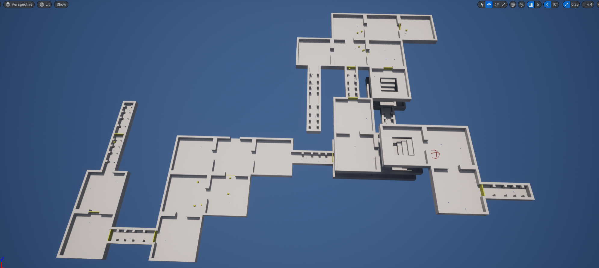
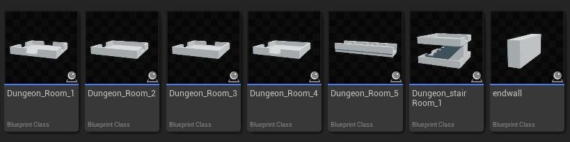
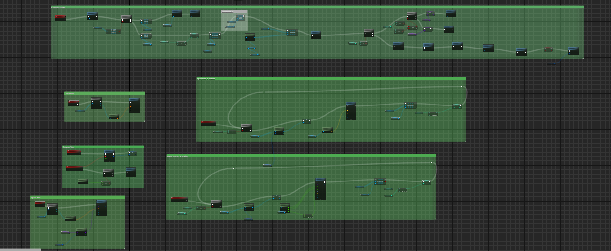
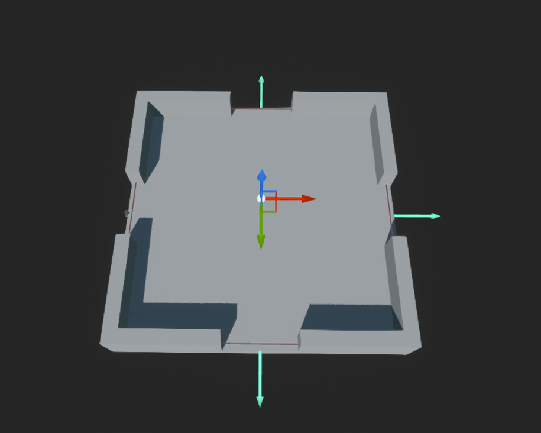
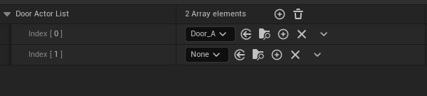
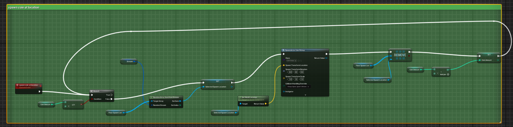
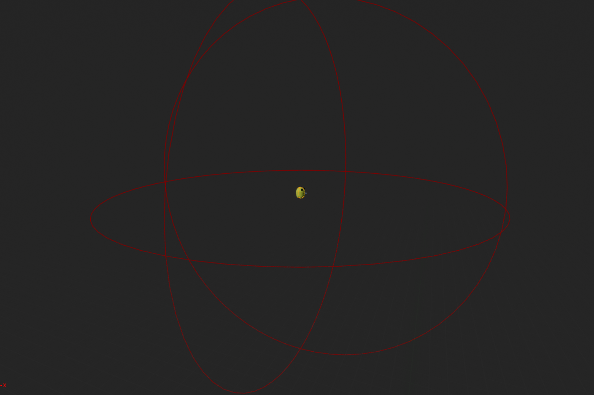

# Final Project!

This is it! The culmination of your procedural graphics experience this semester. For your final project, we'd like to give you the time and space to explore a topic of your choosing. You may choose any topic you please, so long as you vet the topic and scope with an instructor or TA. We've provided some suggestions below. The scope of your project should be roughly 1.5 homework assignments). To help structure your time, we're breaking down the project into 4 milestones:

## Project planning: Design Doc (due 11/6)
Before submitting your first milestone, _you must get your project idea and scope approved by Rachel, Adam or a TA._

### Design Doc
Start off by forking this repository. In your README, write a design doc to outline your project goals and implementation plan. It must include the following sections:

#### Introduction
- What motivates your project?
- The idea for this project comes from combining gameplay elements from Pac-Man and Diablo. I’ve always enjoyed the collection mechanics in Pac-Man and the randomized dungeon generation in Diablo, so I thought it’d be interesting to combine the two. The goal is to create a game where players can explore a procedurally generated dungeon, collect items,and have a unique  experience every time.

#### Goal
- What do you intend to achieve with this project?
- The main goal is to build a dungeon exploration game where players can move around in a randomly generated map, collect items, and enjoy a fresh experience each time due to the varied dungeon layouts.

#### Inspiration/reference:
- You must have some form of reference material for your final project. Your reference may be a research paper, a blog post, some artwork, a video, another class at Penn, etc.  
- Include in your design doc links to and images of your reference material.
- Resources：https://www.youtube.com/watch?v=LQC6EVTgsJ4&t=1s （Procedural Dungeon Generation Tutorial）
- https://www.youtube.com/watch?v=LdpItlRg8OM （Unity Procedural Generation of a 2D Dungeon）

#### Specification:
- Outline the main features of your project.
- Player Movement: Allowing players to move freely within the dungeon.
- Random Dungeon Generation: A new dungeon layout is generated every time the player starts.
- Random Collectible Spawning: Items are randomly placed around the dungeon to encourage exploration.

#### Techniques:
- What are the main technical/algorithmic tools you’ll be using? Give an overview, citing specific papers/articles.
- UE5
- BluePrint
- Binary space partition 
  https://www.roguebasin.com/index.php?title=Basic_BSP_Dungeon_generation
  https://en.wikipedia.org/wiki/Binary_space_partitioning
- L-system
  https://en.wikipedia.org/wiki/L-system

#### Design:
- How will your program fit together? Make a simple free-body diagram illustrating the pieces.
 
#### Timeline:
- Create a week-by-week set of milestones for each person in your group. Make sure you explicitly outline what each group member's duties will be.
- | **Milestone 1 (Nov. 13)** | Set up player movement and the initial Blueprint framework|
| **Milestone 2 (Nov. 25)** | Implement and test the dungeon generation system |
| **Final Submission (Dec. 2)** | Add the random collectible spawning and make sure items appear in accessible spots and Final polish, testing, and bug fixing.| 

Submit your Design doc as usual via pull request against this repository.
## Milestone 1: Implementation part 1 (due 11/13)
Begin implementing your engine! Don't worry too much about polish or parameter tuning -- this week is about getting together the bulk of your generator implemented. By the end of the week, even if your visuals are crude, the majority of your generator's functionality should be done.

Put all your code in your forked repository.

Milestone 1:
Familiar with the UE5 and its blueprints
Allowing players to move with WASD keys 
Allowing players to move with the mouse

Milestone 2:
complete the dungeon generator and I'm going to add more different typr of rooms to generte more complex dungeon

## Final submission (due 12/2)
## Overview
This project is a dungeon game where players experience a unique dungeon layout every time they start a new game. 
The core features of the game include procedurally generated dungeons, ensuring that the overall structure, coin spawn locations, and enemy distributions vary each time the game is played. 
These dynamic elements create a fresh and engaging experience for players, encouraging exploration and adaptability in every session

## Room Random Generation

Each dungeon consists of a total of 30 rooms that are procedurally generated. I designed five distinct room types, each with unique layouts and varying numbers of exits. The generation logic revolves around a list that stores information about the available exit positions of all previously generated rooms.

For each new room, the program randomly selects an exit position from this list and uses it as the starting point for the next room. The type of the new room is also chosen randomly. To prevent multiple rooms from being generated from the same exit, the utilized exit information is removed from the list after each room is generated.

## Door Generation

To enhance the sense of mystery and make the dungeon more complicated, I implemented a random door generation system. After two rooms are connected, the program has a 50% chance of generating a door between them.

## Coin and Enemy Generation

To maintain balance within the game, I set limits on the number of coins and enemies that can be generated. Both coins and enemies are spawned at random locations within the generated dungeon.

Once the predefined maximum number of coins or enemies has been reached, their generation stops

## Enemy AI

Each enemy patrols within a circular area centered around itself, with patrol points being randomly chosen within this radius. Additionally, every enemy is equipped with a trigger mechanism.

If the player enters this trigger area, the enemy detects the player's position and begins to chase them.

## Live Demo
https://youtu.be/q4QX9JEPGF4

## Post Mortem
The overall progress of the final project went smoothly, with each milestone completed on schedule and achieving the desired results.
However, given more time, I would consider improving the distribution of enemies within the dungeon. This adjustment would help prevent situations where enemies are overly concentrated in certain areas, ensuring a more balanced and enjoyable gameplay experience.
